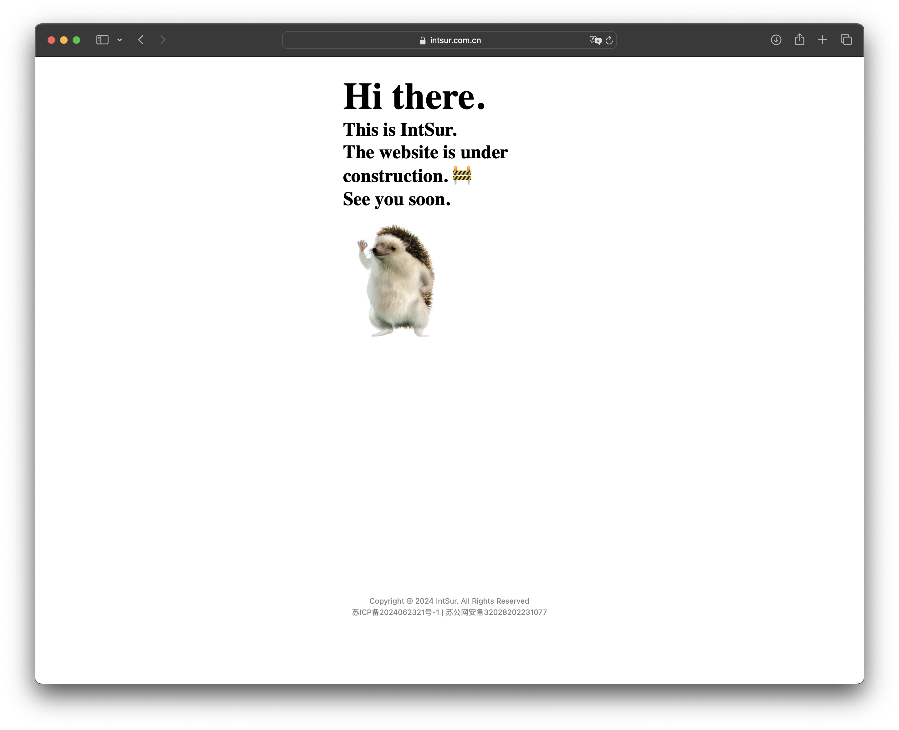

# **IntSur's FrontendTraining**

## Learning Pathway🚏

------

以下Pathway是根据B站技术胖前端学习路径加上自己平时所见整合出的。其中挑选了前端学习中最为重要的骨架课程，并加入了对应的课程笔记。每个课程的源码和资料都在对应的仓库或者文件夹中。如果想了解其他课程，可以查看[前端学习路线.xmind](https://github.com/IntSur/FrontendTraining/blob/main/前端学习路线.xmind)中的思维导图。

### 1.计算机网络原理

Video URL:https://www.bilibili.com/video/BV1FP4y1s73f
Notes:https://flowus.cn/share/eb0f0539-fcd2-4b2e-9e18-37d71bd972b2

### 2.HTTP协议

Video URL:https://www.bilibili.com/video/BV1js411g7Fw
Notes:https://github.com/IntSur/FrontendTraining/tree/main/HTTP

### 3.DNS基本工作原理

Video URL:https://www.bilibili.com/video/BV1GW411j7Ts
Notes:https://www.bilibili.com/read/cv13605206/

### 4.域名 | DNS服务器windows server环境部署与配置

Video URL:https://www.bilibili.com/video/BV1zA411x7Pj

### 5.云服务器 | 个人web项目云服务器(JDK Tomcat Ngnix)部署

Video URL:https://www.bilibili.com/video/BV1Rt411u7k4

### 6.HTTPS加密原理 | SSL/TLS握手过程

Video URL:https://www.bilibili.com/video/BV1KY411x7Jp

### 7.HTML5

Repository URL：https://github.com/IntSur/HTMLTraining

### 8.CSS3

Repository URL:  https://github.com/IntSur/CSSTraining

### 9.JavaScript｜ES6-11

Repository URL:  https://github.com/IntSur/JavaScriptTraining

### 10.Ajax

Repository URL:  https://github.com/IntSur/AjaxTraining

### 11.NPM

Repository URL:  https://github.com/IntSur/npmTraining

### 12.Vue2.0+Vue3.0

Video URL:  https://www.bilibili.com/video/BV1Zy4y1K7SH

## Lisence 🪪

------

MIT License

Copyright (c) 2024 IntSur

Permission is hereby granted, free of charge, to any person obtaining a copy
of this software and associated documentation files (the "Software"), to deal
in the Software without restriction, including without limitation the rights
to use, copy, modify, merge, publish, distribute, sublicense, and/or sell
copies of the Software, and to permit persons to whom the Software is
furnished to do so, subject to the following conditions:

The above copyright notice and this permission notice shall be included in all
copies or substantial portions of the Software.

THE SOFTWARE IS PROVIDED "AS IS", WITHOUT WARRANTY OF ANY KIND, EXPRESS OR
IMPLIED, INCLUDING BUT NOT LIMITED TO THE WARRANTIES OF MERCHANTABILITY,
FITNESS FOR A PARTICULAR PURPOSE AND NONINFRINGEMENT. IN NO EVENT SHALL THE
AUTHORS OR COPYRIGHT HOLDERS BE LIABLE FOR ANY CLAIM, DAMAGES OR OTHER
LIABILITY, WHETHER IN AN ACTION OF CONTRACT, TORT OR OTHERWISE, ARISING FROM,
OUT OF OR IN CONNECTION WITH THE SOFTWARE OR THE USE OR OTHER DEALINGS IN THE
SOFTWARE.